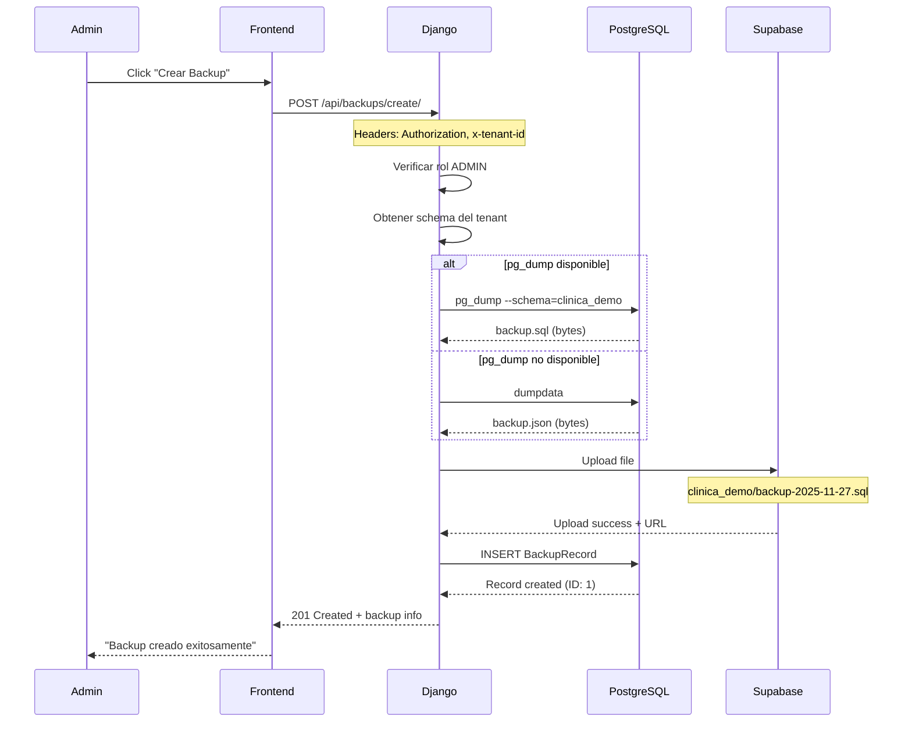

# 🏗️ ARQUITECTURA DEL SISTEMA DE BACKUPS

## 📐 Diseño General

El sistema de backups está diseñado para funcionar en un entorno **multi-tenant** donde cada clínica tiene su propio esquema PostgreSQL aislado.

---

## 🗄️ Componentes del Sistema

### 1. **Modelo de Datos** (`backups/models.py`)

```python
class BackupRecord(models.Model):
    """
    Registro de cada backup creado.
    Vive en el esquema del TENANT (cada clínica tiene sus propios registros).
    """
    
    file_name = models.CharField(max_length=255)
    # Ejemplo: "backup-sql-clinica_demo-2025-11-27-143052.sql"
    
    file_path = models.TextField()
    # Ruta en Supabase: "clinica_demo/backup-sql-clinica_demo-2025-11-27-143052.sql"
    
    file_size = models.BigIntegerField()
    # Tamaño en bytes
    
    backup_type = models.CharField(max_length=10, choices=[
        ('manual', 'Manual'),
        ('automatic', 'Automático')
    ])
    
    created_by = models.ForeignKey(
        settings.AUTH_USER_MODEL,
        on_delete=models.SET_NULL,
        null=True
    )
    # Usuario que creó el backup (solo para manuales)
    
    created_at = models.DateTimeField(auto_now_add=True)
    # Fecha y hora de creación
```

**Ubicación en BD:**
- Schema: `clinica_demo` (o el tenant correspondiente)
- Tabla: `backups_backuprecord`

---

### 2. **API Views** (`backups/views.py`)

#### 2.1. CreateBackupView
```python
POST /api/backups/create/
POST /api/backups/create/?download=true

Rol requerido: ADMIN

Proceso:
1. Intenta crear backup con pg_dump (formato SQL)
2. Si falla, usa dumpdata (formato JSON)
3. Sube el archivo a Supabase Storage
4. Registra en BackupRecord
5. Retorna info del backup (o descarga directa)
```

#### 2.2. BackupHistoryListView
```python
GET /api/backups/history/

Rol requerido: Autenticado

Retorna: Lista de todos los backups del tenant actual
Orden: Más reciente primero (created_at DESC)
```

#### 2.3. DownloadBackupView
```python
GET /api/backups/history/{id}/download/

Rol requerido: Autenticado

Proceso:
1. Busca el BackupRecord por ID
2. Descarga archivo de Supabase Storage
3. Retorna archivo para descarga
```

#### 2.4. DeleteBackupView
```python
DELETE /api/backups/history/{id}/

Rol requerido: ADMIN

Proceso:
1. Busca el BackupRecord por ID
2. Elimina archivo de Supabase Storage
3. Elimina registro de BD
```

---

### 3. **Storage en Supabase** (`backups/supabase_storage.py`)

```python
# Estructura en Supabase Storage

Bucket: backups/
├─ clinica_demo/
│  ├─ backup-sql-clinica_demo-2025-11-27-100000.sql
│  ├─ backup-sql-clinica_demo-2025-11-27-140000.sql
│  └─ backup-json-clinica_demo-2025-11-27-180000.json
│
├─ clinica_abc/
│  ├─ backup-sql-clinica_abc-2025-11-27-090000.sql
│  └─ backup-sql-clinica_abc-2025-11-27-150000.sql
│
└─ otra_clinica/
   └─ backup-sql-otra_clinica-2025-11-26-230000.sql
```

**Funciones principales:**
- `upload_backup_to_supabase()` - Sube archivo
- `download_backup_from_supabase()` - Descarga archivo
- `delete_backup_from_supabase()` - Elimina archivo

---

### 4. **Serializer** (`backups/serializers.py`)

```python
class BackupRecordSerializer(serializers.ModelSerializer):
    created_by = serializers.SerializerMethodField()
    file_size_mb = serializers.ReadOnlyField()
    
    class Meta:
        model = BackupRecord
        fields = [
            'id',
            'file_name',
            'file_path',
            'file_size',
            'file_size_mb',
            'backup_type',
            'created_by',
            'created_at'
        ]
    
    def get_created_by(self, obj):
        if obj.created_by:
            return {
                'id': obj.created_by.id,
                'email': obj.created_by.email,
                'nombre': obj.created_by.nombre
            }
        return None
```

**Ejemplo de respuesta:**
```json
{
  "id": 1,
  "file_name": "backup-sql-clinica_demo-2025-11-27-143052.sql",
  "file_path": "clinica_demo/backup-sql-clinica_demo-2025-11-27-143052.sql",
  "file_size": 2457600,
  "file_size_mb": 2.34,
  "backup_type": "manual",
  "created_by": {
    "id": 5,
    "email": "admin@clinicademo1.com",
    "nombre": "Administrador"
  },
  "created_at": "2025-11-27T14:30:52.123456Z"
}
```

---

## 🔄 Flujo de Creación de Backup



---

## 🔒 Seguridad Multi-Tenant

### Aislamiento por Esquema

Cada request pasa por el middleware de django-tenants que:

1. **Lee el header** `x-tenant-id`
2. **Busca el tenant** en la tabla `tenants_clinica`
3. **Cambia el schema** de PostgreSQL: `SET search_path TO clinica_demo`
4. **Todas las queries** se ejecutan en ese schema

**Resultado:** Un tenant NUNCA puede ver/modificar datos de otro tenant.

### Validaciones de Permisos

```python
# En CreateBackupView
if request.user.rol != 'ADMIN':
    return Response({'error': '...'}, status=403)

# En DeleteBackupView
if request.user.rol != 'ADMIN':
    return Response({'error': '...'}, status=403)
```

### Aislamiento en Supabase

Cada tenant tiene su propia carpeta:
```
backups/
├─ clinica_demo/     ← Solo esta clínica accede aquí
├─ clinica_abc/      ← Solo esta clínica accede aquí
└─ otra_clinica/     ← Solo esta clínica accede aquí
```

---

## 📊 Esquema de Base de Datos

```sql
-- Schema: clinica_demo

CREATE TABLE backups_backuprecord (
    id SERIAL PRIMARY KEY,
    file_name VARCHAR(255) NOT NULL,
    file_path TEXT NOT NULL,
    file_size BIGINT NOT NULL,
    backup_type VARCHAR(10) NOT NULL CHECK (backup_type IN ('manual', 'automatic')),
    created_by_id INTEGER REFERENCES usuarios_usuario(id) ON DELETE SET NULL,
    created_at TIMESTAMP WITH TIME ZONE NOT NULL DEFAULT NOW()
);

CREATE INDEX backups_backuprecord_created_by_id_idx ON backups_backuprecord(created_by_id);
CREATE INDEX backups_backuprecord_created_at_idx ON backups_backuprecord(created_at DESC);
CREATE INDEX backups_backuprecord_backup_type_idx ON backups_backuprecord(backup_type);
```

---

## 🔧 Configuración Requerida

### Variables de Entorno

```bash
# En Render.com o .env local

SUPABASE_URL=https://xxxxx.supabase.co
SUPABASE_KEY=eyJhbGciOiJIUzI1NiIsInR5cCI6IkpXVCJ9...
```

### Settings de Django

```python
# core/settings.py

SUPABASE_URL = config('SUPABASE_URL', default='')
SUPABASE_KEY = config('SUPABASE_KEY', default='')

TENANT_APPS = [
    'backups',  # ← Debe estar aquí
    # ...
]
```

### URLs

```python
# core/urls_tenant.py

urlpatterns = [
    path('api/backups/', include('backups.urls')),
    # ...
]
```

---

## 🧪 Testing

Ver archivo: [05_TESTING.md](05_TESTING.md)

---

## 📈 Estadísticas y Monitoreo

### Información por Backup
- Tamaño del archivo (bytes y MB)
- Fecha y hora exacta
- Usuario que lo creó
- Tipo (manual/automático)

### Queries útiles
```python
# Total de backups
BackupRecord.objects.count()

# Backups del último mes
from datetime import timedelta
from django.utils import timezone

BackupRecord.objects.filter(
    created_at__gte=timezone.now() - timedelta(days=30)
)

# Espacio total usado
from django.db.models import Sum

BackupRecord.objects.aggregate(
    total_bytes=Sum('file_size')
)
```

---

**Siguiente:** [02_ENDPOINTS_API.md](02_ENDPOINTS_API.md) - Documentación detallada de cada endpoint
