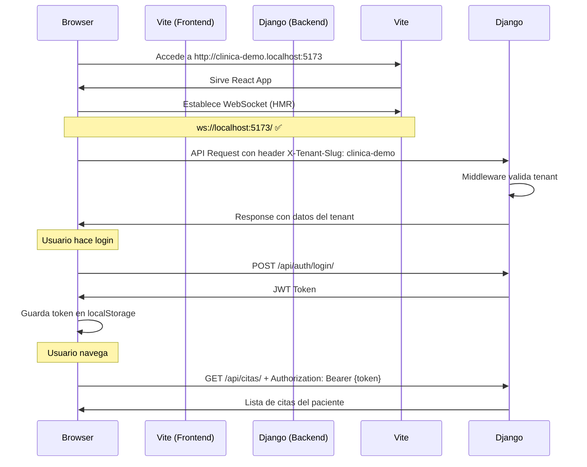

# 🏢 Configuración Multi-Tenant Frontend

## 🎯 Objetivo

Configurar el frontend React + Vite para funcionar correctamente con subdominios multi-tenant:
- `clinica-demo.localhost:5173` (Clínica Demo)
- `clinica-norte.localhost:5173` (Clínica Norte)
- `clinica-sur.localhost:5173` (Clínica Sur)

---

## 🔧 Configuración de Vite

### Archivo: `vite.config.ts`

```typescript
import { defineConfig } from 'vite'
import react from '@vitejs/plugin-react'

export default defineConfig({
  plugins: [react()],
  server: {
    port: 5173,
    host: true, // ← Permite acceso desde subdominios
    hmr: {
      protocol: 'ws',
      host: 'localhost', // ← WebSocket usa localhost directamente
      port: 5173,
      clientPort: 5173
    }
  }
})
```

### ¿Por qué esta configuración?

#### 1. `host: true`
Permite que Vite escuche en todas las interfaces de red, necesario para:
- Acceder desde subdominios
- Funcionar con `clinica-demo.localhost:5173`
- Sin esto: solo funciona en `localhost:5173`

#### 2. Configuración HMR (Hot Module Replacement)
Resuelve los errores de WebSocket:

**Sin configuración**:
```
❌ WebSocket connection to 'ws://clinica-demo.localhost:5173/' failed
❌ WebSocket connection to 'ws://localhost:5173/' failed
```

**Con configuración**:
```
✅ WebSocket se conecta correctamente
✅ Hot reload funciona
✅ Fast refresh activo
```

---

## 🌐 Configuración del Backend (CORS)

El backend Django debe permitir requests desde los subdominios:

### Archivo: `settings.py`

```python
# CORS Configuration
CORS_ALLOWED_ORIGINS = [
    "http://localhost:5173",
    "http://clinica-demo.localhost:5173",
    "http://clinica-norte.localhost:5173",
    "http://clinica-sur.localhost:5173",
]

CORS_ALLOW_CREDENTIALS = True

CORS_ALLOW_HEADERS = [
    'accept',
    'accept-encoding',
    'authorization',
    'content-type',
    'dnt',
    'origin',
    'user-agent',
    'x-csrftoken',
    'x-requested-with',
    'x-tenant-slug',  # ← Header multi-tenant
]

# Permitir subdominios con wildcard (desarrollo)
CORSWHITELIST_REGEX = r'^http://.*\.localhost:5173$'
```

---

## 📝 Configuración de apiConfig.ts

### Archivo: `src/config/apiConfig.ts`

```typescript
import axios from 'axios';

// Base URL del backend
const API_BASE_URL = import.meta.env.VITE_API_BASE_URL || 'http://localhost:8000';

const api = axios.create({
  baseURL: API_BASE_URL,
  headers: {
    'Content-Type': 'application/json',
  },
  withCredentials: true, // ← Importante para CORS con cookies
});

// Interceptor para agregar tenant slug desde el subdominio
api.interceptors.request.use(
  (config) => {
    // Extraer slug del subdominio
    const hostname = window.location.hostname;
    const subdomain = hostname.split('.')[0];
    
    // Agregar header X-Tenant-Slug
    if (subdomain && subdomain !== 'localhost') {
      config.headers['X-Tenant-Slug'] = subdomain;
    }
    
    // Agregar token de autenticación
    const token = localStorage.getItem('access_token');
    if (token) {
      config.headers['Authorization'] = `Bearer ${token}`;
    }
    
    return config;
  },
  (error) => Promise.reject(error)
);

export default api;
```

---

## 🧪 Verificación

### 1. Verificar Configuración de Vite

```bash
# Terminal
cd ClinicaDental-frontend2
npm run dev
```

**Salida esperada**:
```
VITE v5.x.x  ready in XXX ms

➜  Local:   http://localhost:5173/
➜  Network: http://192.168.x.x:5173/
➜  press h + enter to show help
```

### 2. Verificar Subdominios

Abrir en el navegador:
- ✅ `http://localhost:5173/` → Funciona
- ✅ `http://clinica-demo.localhost:5173/` → Funciona
- ✅ `http://clinica-norte.localhost:5173/` → Funciona

### 3. Verificar Hot Reload

1. Edita un componente React
2. Guarda el archivo (Ctrl+S)
3. **Esperado**: Navegador se actualiza automáticamente sin recargar
4. **No debe aparecer**: Errores de WebSocket en la consola

### 4. Verificar Logs del Navegador

**Antes de la configuración**:
```
❌ GET http://clinica-demo.localhost:5173/@vite/client net::ERR_NAME_NOT_RESOLVED
❌ WebSocket connection to 'ws://clinica-demo.localhost:5173/' failed
```

**Después de la configuración**:
```
✅ [vite] connected.
✅ [vite] hot updated: /src/App.tsx
```

---

## 🐛 Solución de Problemas

### Error 1: WebSocket sigue fallando

**Síntoma**:
```
❌ WebSocket connection to 'ws://localhost:5173/' failed: Connection refused
```

**Solución**:
1. Verifica que Vite esté corriendo
2. Limpia caché del navegador (Ctrl+Shift+Delete)
3. Reinicia el servidor de Vite

```bash
npm run dev
```

### Error 2: CORS bloqueado

**Síntoma**:
```
❌ Access to XMLHttpRequest at 'http://localhost:8000/api/...' 
   from origin 'http://clinica-demo.localhost:5173' has been blocked by CORS policy
```

**Solución**:
1. Verifica `CORS_ALLOWED_ORIGINS` en `settings.py`
2. Agrega el subdominio específico
3. Reinicia el servidor Django

```python
CORS_ALLOWED_ORIGINS = [
    "http://clinica-demo.localhost:5173",  # ← Agregar este
]
```

### Error 3: Header X-Tenant-Slug no llega

**Síntoma**:
```python
# Backend log
WARNING: No se proporcionó X-Tenant-Slug header
```

**Solución**:
1. Verifica que estés accediendo desde un subdominio (no `localhost`)
2. Revisa el interceptor en `apiConfig.ts`
3. Inspecciona headers en DevTools → Network

### Error 4: Hot reload no funciona

**Síntoma**: Tienes que recargar manualmente (F5) cada vez

**Solución**:
1. Verifica `hmr` en `vite.config.ts`
2. Asegúrate de que `host: true` esté configurado
3. Reinicia Vite con caché limpio:

```bash
npm run dev -- --force
```

---

## 📊 Flujo Completo



---

## 🎯 Checklist de Configuración

### Frontend
- [ ] `vite.config.ts` actualizado con `server.host: true`
- [ ] `vite.config.ts` tiene configuración `hmr`
- [ ] `apiConfig.ts` tiene interceptor para `X-Tenant-Slug`
- [ ] `apiConfig.ts` tiene interceptor para `Authorization`
- [ ] Variables de entorno configuradas (`.env`)

### Backend
- [ ] `CORS_ALLOWED_ORIGINS` incluye subdominios
- [ ] `CORS_ALLOW_HEADERS` incluye `x-tenant-slug`
- [ ] Middleware de tenant instalado
- [ ] Tenants creados en base de datos
- [ ] Usuarios de prueba creados por tenant

### Verificación
- [ ] Hot reload funciona sin errores
- [ ] WebSocket conecta correctamente
- [ ] API requests llegan al backend
- [ ] Header `X-Tenant-Slug` se envía
- [ ] Login funciona desde subdominio
- [ ] Datos filtrados por tenant correctamente

---

## 🚀 Siguiente Paso

Una vez configurado todo:
1. ✅ Accede desde `http://clinica-demo.localhost:5173`
2. ✅ Haz login con un usuario de ese tenant
3. ✅ Verifica que solo veas datos de esa clínica
4. ✅ Abre otra pestaña con `http://clinica-norte.localhost:5173`
5. ✅ Verifica que los datos sean diferentes

**Sistema multi-tenant completamente funcional** 🎉
